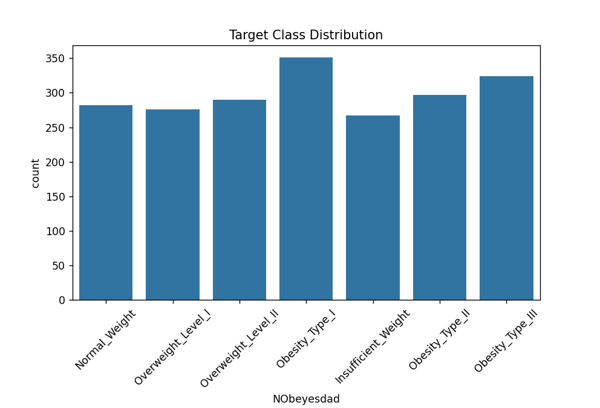

# ml-assignment2

## Problem statement
The goal of this assignment is to build and evaluate machine learning models for a given dataset. Following 
machine learning algorithms will be used for model training:
- Logistic Regression
- Decision Tree Classifier
- K-Nearest Neighbors Classifier
- Naive Bayes Classifier - GaussianNB
- Ensemble Model - Random Forest Classifier
- Ensemble Model - XGBoost Classifier

## Dataset description
Following data set is used for this assignment:
- Estimation of Obesity Levels Based on Eating Habits and Physical Condition
  - https://archive.ics.uci.edu/dataset/544/estimation+of+obesity+levels+based+on+eating+habits+and+physical+condition
  - Further more https://www.sciencedirect.com/science/article/pii/S2352340919306985?via%3Dihub this was referred to understand the data set and its features.
- This dataset include data for the estimation of obesity levels in individuals from the countries of Mexico, Peru and Colombia, based on their eating habits and physical condition. The data contains 17 attributes and 2111 records, the records are labeled with the class variable NObesity (Obesity Level), that allows classification of the data using the values of Insufficient Weight, Normal Weight, Overweight Level I, Overweight Level II, Obesity Type I, Obesity Type II and Obesity Type III. 77% of the data was generated synthetically using the Weka tool and the SMOTE filter, 23% of the data was collected directly from users through a web platform.
- Dataset: data/ObesityDataSet_raw_and_data_sinthetic.csv 
- To enable standalone testing via streamlit, we first splitted original data into 2 parts 80% training and 20% test
- Training data: data/ObesityDataSet_train.csv
- Test data: data/ObesityDataSet_test.csv
- The training data will be further splitted into train and validation data during model training phase.
- Details of data basis EDA:

| Attribute             | Value                      |
|-----------------------|----------------------------|
| Total no. of rows     | 2111                       |
| Total no. of features | 16                         |
| Any missing value     | No                         |
| Problem type          | Multi-class classification |
| Target Variable       | NObeyesdad                 |
| No. of Target Classes | 7                          |

- Feature Description

| #  | Feature                        | Description                               |
|----|--------------------------------|-------------------------------------------|
| 1  | Gender                         | Gender of person                          |
| 2  | Age                            | Age of person                             |
| 3  | Height                         | Height of person                          |
| 4  | Weight                         | Weight of person                          |
| 5  | family_history_with_overweight | any family history                        |
| 6  | FAVC                           | Frequent consumption of high caloric food |
| 7  | FCVC                           | Frequency of consumption of vegetables    |
| 8  | NCP                            | Number of main meals                      |
| 9  | CAEC                           | Consumption of food between meals         |
| 10 | SMOKE                          | weather person smokes                     |
| 11 | CH20                           | Consumption of water daily                |
| 12 | SCC                            | Calories consumption monitoring                                           |
| 13 | FAF                            | Physical activity frequency                                          |
| 14 | TUE                            | Time using technology devices                                          |
| 15 | CALC                           |   Consumption of alcohol                                          |
| 16 | MTRANS                         |   Transportation used                                        |

- Target Variable Description
    - NObeyesdad (Obesity Level) - Target Variable
    - Values: Insufficient Weight, Normal Weight, Overweight Level I, Overweight Level II, Obesity Type I, Obesity Type II, Obesity Type III

Following features/target have been found to be categorical variables with unique values:
Unique values in column 'Gender': ['Female' 'Male']
Unique values in column 'family_history_with_overweight': ['yes' 'no']
Unique values in column 'FAVC': ['no' 'yes']
Unique values in column 'CAEC': ['Sometimes' 'Frequently' 'Always' 'no']
Unique values in column 'SMOKE': ['no' 'yes']
Unique values in column 'SCC': ['no' 'yes']
Unique values in column 'CALC': ['no' 'Sometimes' 'Frequently' 'Always']
Unique values in column 'MTRANS': ['Public_Transportation' 'Walking' 'Automobile' 'Motorbike' 'Bike']
Unique values in column 'NObeyesdad': ['Normal_Weight' 'Overweight_Level_I' 'Overweight_Level_II'
 'Obesity_Type_I' 'Insufficient_Weight' 'Obesity_Type_II'
 'Obesity_Type_III']

Statistical Summary of Numerical Features:

| Statistic | Age | Height | Weight | FCVC | NCP | CH2O | FAF | TUE |
|---|---:|---:|---:|---:|---:|---:|---:|---:|
| count | 2087.000000 | 2087.000000 | 2087.000000 | 2087.000000 | 2087.000000 | 2087.000000 | 2087.000000 | 2087.000000 |
| mean  | 24.353090 | 1.702674 | 86.858730 | 2.421466 | 2.701179 | 2.004749 | 1.012812 | 0.663035 |
| std   | 6.368801 | 0.093186 | 26.190847 | 0.534737 | 0.764614 | 0.608284 | 0.853475 | 0.608153 |
| min   | 14.000000 | 1.450000 | 39.000000 | 1.000000 | 1.000000 | 1.000000 | 0.000000 | 0.000000 |
| 25%   | 19.915937 | 1.630178 | 66.000000 | 2.000000 | 2.697467 | 1.590922 | 0.124505 | 0.000000 |
| 50%   | 22.847618 | 1.701584 | 83.101100 | 2.396265 | 3.000000 | 2.000000 | 1.000000 | 0.630866 |
| 75%   | 26.000000 | 1.769491 | 108.015907 | 3.000000 | 3.000000 | 2.466193 | 1.678102 | 1.000000 |
| max   | 61.000000 | 1.980000 | 173.000000 | 3.000000 | 4.000000 | 3.000000 | 3.000000 | 2.000000 |

Target visualization:

Conclusions from EDA:
- There are no missing values in the dataset.
- Categorical features need to be encoded before feeding into ML models.
- Target variable is multi-class in nature with 7 unique classes.
- The data contains 17 attributes and 2111 records
- Data seems to be having near normal distribution as mean and median values are close to each other.
- Target class is also balanced with each class having decent number of records.
- We notice some outliers but since we are using logistic regression and decision tree models, 
- we can avoid treating them as these models are not much affected by outliers.

# Models used
- Logistic Regression
- Decision Tree Classifier
- K-Nearest Neighbors Classifier
- Naive Bayes Classifier - GaussianNB
- Ensemble Model - Random Forest Classifier
- Ensemble Model - XGBoost Classifier

# Model comparison table

| ML Model Name                      | Accuracy |   AUC | Precision | Recall |    F1 |   MCC |
|------------------------------------|---------:|------:|----------:|-------:|------:|------:|
| Logistic Regression                |     0.92 | 0.992 |      0.92 |   0.92 |  0.92 |  0.91 |
| Decision Tree       |    0.934 |  0.96 |     0.935 | 0.9338 | 0.933 | 0.923 |
| kNN                                |    0.808 | 0.968 |     0.806 |  0.808 | 0.798 | 0.779 |
| Naive Bayes |    0.506 | 0.833 |     0.528 |  0.506 | 0.457 | 0.446 |
| Random Forest ( Ensemble )         |    0.938 | 0.993 |     0.945 |  0.938 |  0.94 | 0.929 |
| XGBoost ( Ensemble )               |    0.945 | 0.997 |     0.947 |  0.945 | 0.946 |  0.94 |

# Model observations table
| ML Model Name                      | Observations                                                                                                                                                                                                                                                                                                                                                                                                                                                                                                                                                                               |
|------------------------------------|--------------------------------------------------------------------------------------------------------------------------------------------------------------------------------------------------------------------------------------------------------------------------------------------------------------------------------------------------------------------------------------------------------------------------------------------------------------------------------------------------------------------------------------------------------------------------------------------|
| Logistic Regression                | <ol><li>100 Iterations unable to converge.</li><li>10000 Iterations able to converge with accuracy 89.71, default C = 1.</li><li>10000 Iterations able to converge with accuracy 92, C = 10, hence regularization value as 0.1.</li><li>For evaluation metrics we choose to go with OVR strategy as we have 7 multiple classes.</li><li>Decent performance despite being a linear model suggests that my target classes are somewhat separable in the feature space.</li><li>The C=10 regularization improvement (89%→94%) shows L2 penalty was reducing overfitting effectively</li></ol> |
| Decision Tree                      | <ol><li>Got 83% accuracy with max depth 5.</li><li>Got 93.4% accuracy with max depth 10.</li><li>Default criterion gini was used but we don't have binary split, using entropy.</li><li>Max depth tuning (5→10) significantly improved performance because obesity classification requires deeper decision paths to capture conditional logic</li></ol>                                                                                                                                                                                                                                    |
| kNN                                | <ol><li>Model did not perform well with accuracy of 80.8%.</li><li>Struggles because obesity classification exists in high-dimensional space (16 features post-encoding).With many dimensions distances dont help much.</li><li>Increasing K from 5 to 10 only increased accuracy from 80 to 81. </li></ol>                                                                                                                                                                                                                                                                                |
| Naive Bayes                        | <ol><li>Model did not perform well with accuracy of 50.6%.</li><li>GaussianNB model is not suitable for this dataset.</li><li>GaussianNB assumes feature independence, but our data violates this assumption. Weight and BMI-related features are highly correlated.</li></ol>                                                                                                                                                                                                                                                                                                             |
| Random Forest ( Ensemble )         | <ol><li>Model performed well with accuracy of 93.8%.</li><li>Hyperparameter tuning improved accuracy slightly.</li><li>Strong performance due to ensemble diversity.</li></ol>                                                                                                                                                                                                                                                                                                                                                                                                             |
| XGBoost ( Ensemble )               | <ol><li>Model performed best with accuracy of 94.5%.</li><li>Hyperparameter tuning improved accuracy slightly.</li><li>Excels because it uses gradient boosting with sequential error correction. Each tree learns from previous mistakes, making it ideal for complex, non-linear relationships in obesity classification.</li></ol>                                                                                                                                                                                                                                                                                                                                                                                                                                                          |

# Conclusion

## XGBoost (94.5% - Best Performer)
Excels because it uses gradient boosting with sequential error correction. Each tree learns from previous mistakes, making it ideal for complex, non-linear relationships in obesity classification.
Our dataset has mixed feature types (continuous + categorical) and XGBoost handles this naturally without explicit preprocessing.

